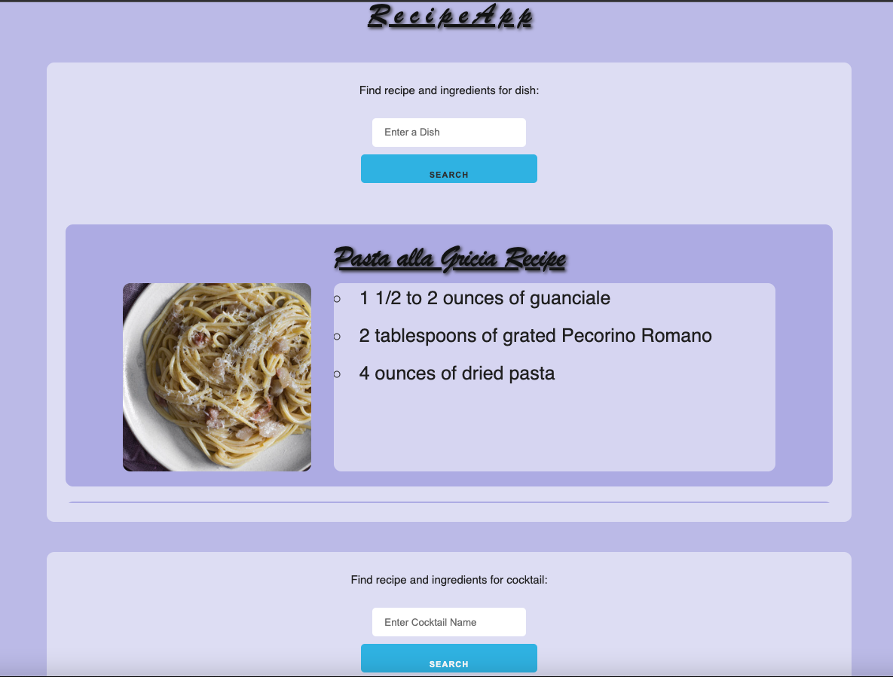

  
  # Recipe App 
  ## Description
  When trying to find a recipe for food and drinks, sometimes it takes a long time to surf the internet, find a recipe, and scroll a long time before finally finding the ingredients list. This app allows a user to type in a food and drink, and a beautiful picture and a recipe are displayed to a screen. That way, a user can quickly copy the ingredients to their grocery list.  

  ## Table of Contents
  - [Installation](#installation)
  - [Usage](#usage)
  - [Credits](#credits)
  - [License](#license)
  - [Tests](#tests)
  - [Questions](#questions)

  ## Installation
  To run this app, all you need is internet connection. There is no need to install anything. 
  ## Usage 
  When trying to find a recipe for food and drinks, sometimes it takes a long time to surf the internet, find a recipe, and scroll a long time before finally finding the ingredients list. This app allows a user to type in a food and drink, and a beautiful picture and a recipe are displayed to a screen. That way, a user can quickly copy the ingredients to their grocery list. 
  
 
  ## License 
  This project is licensed under the MIT License. See here: (https://opensource.org/licenses/MIT) 
  ## Credits
  This app was also developed by Amia Badgett, Max Martinez, and Rilwan Etti. To contribute, please add to the JavaScript, HTML, and CSS files by pushing your changes via a branch in Github. We used two third-party apps: Edaman and CocktailDB.
  ## Tests 
  Test instructions will be provided here once available. 
  ## Questions 
  - Github URL is at: http://github.com/jalland
  - Reach me with any questions at jjalland@gmail.com

  ## Video Description to create README
  https://drive.google.com/file/d/1g0bDbU7QE3bOIousfKLGqmyWlg12Xf4G/view
  